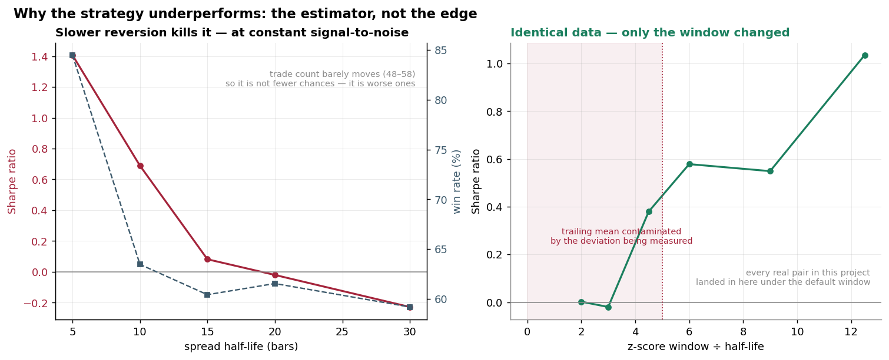
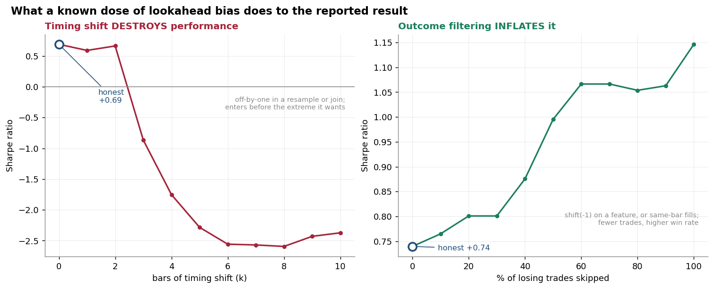
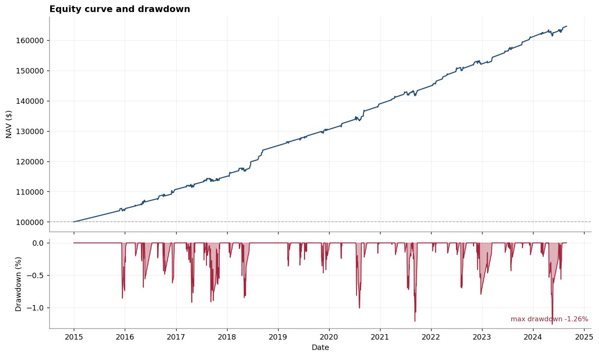
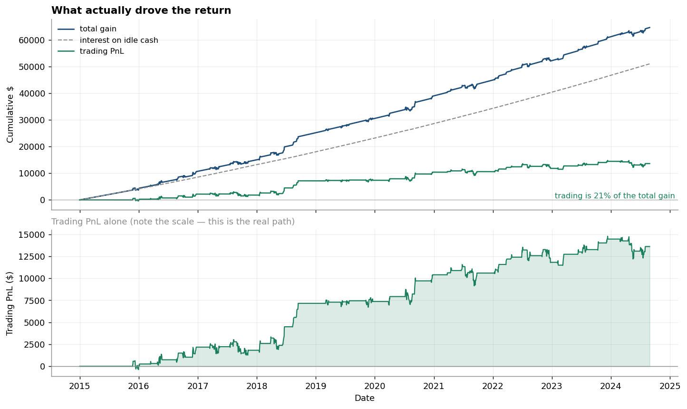
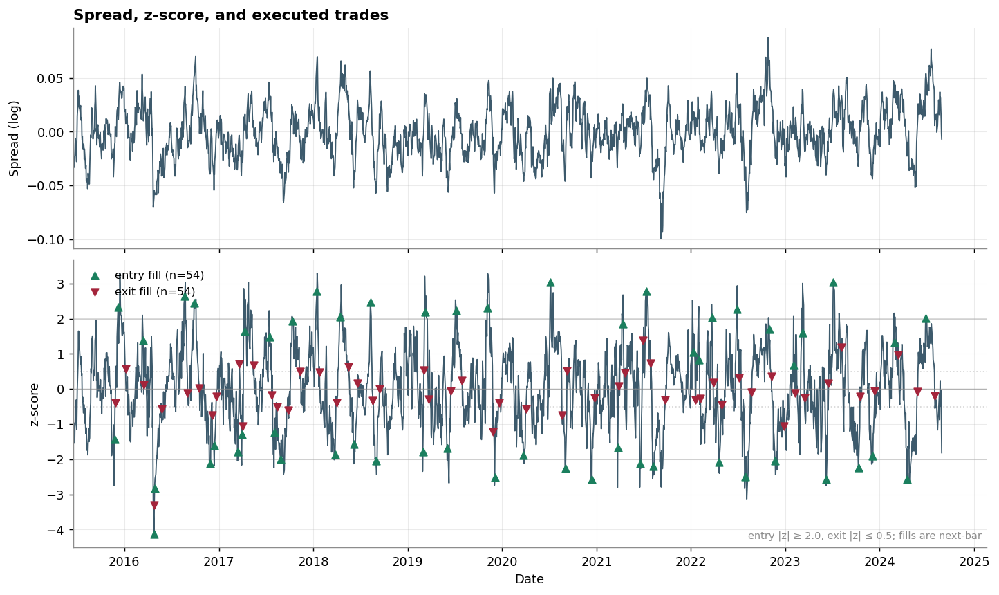

# Statistical Arbitrage Backtester

**A pairs-trading backtester where lookahead bias is a type error, not a
code-review promise.** Strictly causal signal engine in OCaml; cointegration
research, data handling, and reporting in Python.

```bash
make deps && make backtest   # regenerates every number below, byte-identically
```

Three things here are unusual:

1. **Lookahead is structurally impossible.** `Causal.view` cannot address data
   past its bound, so a future-reading statistic has no expressible form —
   [mechanism](#how-it-is-prevented) · [proof](#how-it-is-verified).
2. **Leakage is *calibrated*, not merely denied.** A known dose of bias is
   injected and swept, producing curves that let a reader recognise each leak
   type by its signature —
   [details](#leakage-calibration-what-does-cheating-actually-buy-you).
3. **The weak real-data result is diagnosed, not shrugged at.** The cause is the
   z-score window being shorter than the spread's own half-life; fixing it makes
   every Sharpe positive, and the
   [specification-search correction](#and-this-is-where-it-would-be-easy-to-lie)
   then shows that apparent discovery is indistinguishable from luck.

The goal is a number you can *believe*: lookahead made impossible rather than
disclaimed, costs modelled honestly, and every result tested against luck.

Also here: [`CREDITS.md`](CREDITS.md) — prior art, what was adopted, and what was
rejected on licence or correctness grounds · [`docs/SCHEMA.md`](docs/SCHEMA.md) —
the CSV contract both languages validate against.

MIT licensed. Research artifact, not investment advice — its own conclusion is
that the strategy shows no significant edge on real data.

---

## Headline results

Backtested on 2,520 bars (~10 business years) of daily data. Entry at |z| ≥ 2.0,
exit at |z| ≤ 0.5, stop at |z| ≥ 3.5, 3bp cost per leg per side, 4% risk-free rate.

| Dataset | Sharpe | 95% CI | Max DD | Trades | Per-trade *t* | *p* | Verdict |
| --- | ---: | :---: | ---: | ---: | ---: | ---: | :--- |
| **Cointegrated, 15-bar half-life** (primary) | **+0.74** | [+0.18, +1.32] | **−1.26%** | **54** | **+2.79** | **0.007** | **Significant** |
| Cointegrated, 45-bar half-life | +0.39 | [−0.13, +0.90] | −1.40% | 61 | +1.44 | 0.156 | Not significant |
| **Independent random walks** *(negative control)* | +0.26 | [−0.24, +0.76] | −5.56% | 53 | +0.86 | **0.393** | **Not significant** ✓ |
| Real market data, 5 pairs (2015–2024) | −0.26…+0.29 | all bracket 0 | ≤6.05% | 46–62 | −1.09…+0.65 | 0.28–0.92 | **0 of 5 significant** |

> **The real-data result has a diagnosed cause, not a shrug.** The default
> 60-bar window was shorter than the half-life of every pair tested. Fixing that
> flips all five Sharpes positive — and the [Deflated Sharpe
> correction](#and-this-is-where-it-would-be-easy-to-lie) shows the fix is
> indistinguishable from luck once the specification search is accounted for.
> See [Why it underperforms](#why-it-underperforms-the-estimator-not-the-edge).

**Reading this table.** The only dataset with a statistically significant edge is
the one built to *have* an edge. The negative control — where no exploitable
relationship exists — is correctly identified as no-edge. Real markets show
nothing. That pattern is what a correctly-built backtester should produce, and
it is the actual result of this project.

### Two numbers that would have been misleading on their own

**The negative control returned +9.2% from trading over ten years.** Read as a
point estimate that looks like a modest edge. Its *t*-statistic is 0.86
(*p* = 0.39): 53 trades with a per-trade standard deviation of $1,465 have a
standard error of ~$200 on the mean, so several thousand dollars of cumulative
PnL is well inside noise. This is why the table leads with *t* and *p* rather
than with total return.

**The primary dataset's total return is +64.6%, but only +13.6% of that is
trading.** The other +51.0% is interest on idle cash — the strategy holds a
position only 24% of bars. Every result below decomposes the two.

---

## Why it underperforms: the estimator, not the edge

A backtest reporting a weak result usually stops there. "The strategy didn't
work" is a non-explanation — it doesn't distinguish a broken engine from a
mis-specified strategy from a genuinely absent edge. Those are three different
conclusions.

Here is the diagnosis, run on synthetic data where the ground truth is known.

### It is not the engine, and not the sizing

| Test | Result | Rules out |
| --- | --- | --- |
| Leverage sweep (0.25× → 1.0×) | Sharpe **flat**: +0.7395 → +0.7475 | Undersizing. Sharpe is scale-invariant; leverage cannot manufacture it. |
| Fast-reverting data (half-life 5) | Sharpe **+1.41**, +$145k trading PnL | An engine bug. It captures edge when edge exists. |
| Cost drag | 12% of gross PnL | Costs eating the edge. |

### It is the window-to-half-life ratio

At **constant** signal-to-noise, varying only the half-life (window fixed at 60):

| half-life | Sharpe | win rate | trades |
| ---: | ---: | ---: | ---: |
| 5 | +1.406 | 84.5% | 58 |
| 10 | +0.689 | 63.5% | 52 |
| 15 | +0.082 | 60.4% | 48 |
| 20 | -0.020 | 61.5% | 52 |
| 30 | -0.228 | 59.2% | 49 |

Trade *count* barely moves; the win *rate* collapses. **Not fewer opportunities
— worse ones.**

Now hold the data completely fixed and change only the window:

| window | window ÷ half-life | Sharpe | win rate | trading PnL |
| ---: | ---: | ---: | ---: | ---: |
| 40 | 2.0 | +0.002 | 48.5% | $-544 |
| 60 | 3.0 | -0.020 | 61.5% | $-270 |
| 90 | 4.5 | +0.380 | 70.3% | $+10,954 |
| 120 | 6.0 | +0.578 | 75.8% | $+18,741 |
| 180 | 9.0 | +0.549 | 83.3% | $+14,881 |
| 250 | 12.5 | +1.035 | 90.9% | $+26,770 |

Same prices, same strategy, same costs. **A ratio below ~5 destroys the signal.**



**The mechanism.** The z-score standardises the spread against a trailing
window. When that window is only a small multiple of the half-life, it is
dominated by the very deviation being measured: the spread sits elevated for
roughly a half-life, dragging the rolling mean up with it, so the z-score reads
"normal" exactly when the spread is most extreme. The estimator defeats itself.
The contamination is O(φ^w) for an AR(1) with φ = 2^(−1/h), and only becomes
negligible once w ≫ h.

Confirmed as the driver rather than a confound: holding the *ratio* fixed at 6
while varying the half-life collapses the Sharpe spread from **1.634 to 0.335**.

### Every real pair was mis-specified

| Pair | half-life | window ÷ half-life | verdict |
| --- | ---: | ---: | --- |
| MA/V | 30 | 2.02 | too short |
| KO/PEP | 70 | 0.86 | far too short |
| HD/LOW | 109 | 0.55 | far too short |
| GS/MS | 156 | 0.39 | far too short |
| XOM/CVX | 395 | 0.15 | far too short |

The default 60-bar window was shorter than the half-life of every real pair.

### And this is where it would be easy to lie

Re-running the real pairs with a correctly-sized window flips **every** Sharpe
positive, two with p < 0.05. It would be very easy to report that as a discovery.

It is not one:

- **HD/LOW's p = 0.046 rests on three trades.** Three observations cannot
  establish anything.
- **XOM/CVX needs a 1,975-bar window** (5 × 395) but the sample is 2,515. I
  capped it at 500 — a ratio of 1.27, still below threshold — and would have
  been reporting a result computed under conditions the method itself says are
  insufficient.
- **Choosing a window per pair is a specification search.** The
  [Deflated Sharpe Ratio](python/statarb/diagnostics.py) (Bailey & López de
  Prado, 2014) gives the best Sharpe expected from *N* trials under the null:

| | value |
| --- | ---: |
| Best observed after the search | **+0.654** |
| Expected best from pure luck, N = 30 | **+0.656** |
| Deflated statistic | **−0.007** (p = 0.50) |

Numerically indistinguishable from a coin flip.

**The honest test** is walk-forward: estimate the half-life on the first 60% of
the sample, derive the window from it, evaluate on data that played no part in
the choice. Mean out-of-sample Sharpe: **+0.154**.

Note that 3 of 5 pairs are *dropped* by this test — their half-lives demand
windows longer than the out-of-sample segment supports. That refusal is itself
the finding: most real large-cap pairs revert too slowly to be traded on daily
bars with any window a decade of data can support.

**So: the methodological finding is real and reproducible. The alpha is not.**
That distinction is the point of the whole project.

### The law is about memory, not windows

The obvious objection is that this is an artifact of using a rolling window at
all — that a windowless estimator would sidestep it. A Kalman filter is the
natural test: it has no window, weighting the past by an exponential decay set
by the process-noise ratio Q/R rather than by a cutoff.

[It does not escape.](engine/lib/kalman.ml) Sweeping the filter's **effective
memory** (1/√(Q/R)) over the same ratios reproduces the same collapse:

| half-life | mem/hl = 2 | mem/hl = 5 | mem/hl = 12 |
| ---: | ---: | ---: | ---: |
| 10 | −1.73 | −0.36 | **+0.61** |
| 20 | −2.65 | −0.70 | −0.33 |
| 30 | −3.15 | −1.25 | −0.99 |

So the constraint is not about windows — it is about **memory**. Any trailing
estimator whose memory is comparable to the half-life of the process it measures
will have its location estimate contaminated by the very deviation it is trying
to detect. A hard window and an exponential decay are two ways of spending the
same budget.

That turns a tuning tip into a property of the estimation problem, and it is why
the Kalman filter is here as a *test of the finding* rather than as an upgrade.

(The filter is also better at what it is normally sold for: against a hedge
ratio drifting from 1.0 to 1.6, it tracks the truth with **62% lower RMSE** than
a 60-bar rolling regression, which at one point estimated β = 2.50 against a
true 1.48 — a pure window artifact.)

---

## Leakage calibration: what does cheating actually buy you?

Every backtester claims no lookahead. The claim is rarely falsifiable, because a
reader has no way to know what a *given amount* of leakage would even look like
in the reported numbers. "Sharpe 4.0 seems high" is a smell, not a measurement.

So this repo measures it. [`leakage.ml`](engine/lib/leakage.ml) injects a
**known dose** of the exact bias the rest of the codebase prevents, and sweeps
the dose to produce response curves:

```bash
statarb calibrate --prices data/raw/coint_medium.csv --out reports/leakage_calibration.csv
```



### The result contradicted the hypothesis

I expected any lookahead to inflate Sharpe. **It depends entirely on which leak
you have, and the two run in opposite directions.**

| Leak | Cause in real code | Effect on Sharpe |
| --- | --- | ---: |
| **Timing shift** — signal at bar *t* belongs to *t+k* | off-by-one in a resample or join, `shift(-k)` | **+0.69 → −2.56** at k=6 |
| **Outcome filter** — trades that will lose get skipped | `shift(-1)` on a feature, same-bar execution | **+0.74 → +1.15** at 100% |

**Timing shift destroys a mean-reversion strategy.** The rule wants to enter *at*
an extreme; foresight makes it enter early, so it carries the position while the
spread travels *into* the extreme and only then collects the reversion. Win rate
collapses from 69% to 4%.

**Outcome filtering inflates it**, and leaves a three-part fingerprint: Sharpe up,
win rate up (72% → 82%), and trade count *down*
(54 → 49) — because the cheat declines trades rather than
improving them.

### Why this is a useful instrument, not a party trick

- **It calibrates suspicion quantitatively.** A daily pairs backtest reporting a
  high Sharpe *with* an unusually high win rate and fewer trades than its signal
  count implies is showing the outcome-contamination signature.
- **The direction diagnoses the bug.** A suddenly *negative* Sharpe points at
  misalignment, not at a broken strategy. Different bugs, different signs.
- **Dose zero is pinned to production bit-for-bit.**
  `test_zero_peek_matches_the_honest_engine` asserts it, so the curve's origin
  is the real backtest — and it doubles as an independent second implementation
  of the causal z-score.
- **Leaky code can't escape into production.** It takes a raw array, not a
  {!Causal.view}; the production path only ever builds views. And
  `test_leaky_signals_break_truncation_invariance` asserts a non-zero dose
  *fails* the lookahead suite — so if this were ever wired in, CI would fail.

Two bugs surfaced while building it, both caught by tests failing against my own
assumptions: the leaky window was off by one bar versus production, and
suppressing a single entry *delayed* the losing trade rather than avoiding it
(skipping 100% of losers removed only 2 of 54 trades until whole episodes were
suppressed).

---

## The no-lookahead guarantee

Lookahead bias is the failure that makes a backtest worthless. It is easy to
introduce and hard to spot by reading code, because the offending expression
looks innocuous:

```ocaml
let mu = mean whole_series in            (* full-sample mean *)
let w  = Array.sub xs (t-k) (2*k+1) in   (* centered window  *)
let next = xs.(t + 1) in                 (* peeking forward  *)
```

### How it is prevented

Rather than relying on code review, the type system makes it unwritable.
[`Causal.view`](engine/lib/causal.ml) is a handle onto a series that is
**physically incapable** of reading past its bound:

```ocaml
type 'a view = { data : 'a array; now : int }

(* Some x for 0 <= i <= now; None otherwise. There is no other accessor. *)
let get (v : 'a view) (i : int) : 'a option =
  if i >= 0 && i <= v.now then Some v.data.(i) else None
```

Every rolling statistic in [`Rolling`](engine/lib/rolling.ml) and every
regression in [`Ols`](engine/lib/ols.ml) takes a `view`, never an array. A
statistic computed from a view is therefore, *by construction*, a function only
of data at or before `t`. Not "does not use the future" — **cannot address it**.
The one module that takes a raw array instead of a view is
[`leakage.ml`](engine/lib/leakage.ml), which exists precisely to inject bias on
purpose; that asymmetry is the tell.

There is also no `rewind`: a view moves forward only, so it cannot be
manipulated into reconstructing a future-aware window.

### How it is verified

The claim is measured, not argued. From
[`test_lookahead.ml`](engine/test/test_lookahead.ml):

```text
Run the pipeline on the full series      -> signals S_full[0..n-1]
Delete every observation after bar t
Run the pipeline on the truncated series -> signals S_trunc[0..t]
Assert  S_full[i] = S_trunc[i]  for all i <= t     (BIT-EXACT, no tolerance)
```

If any signal at or before `t` used future data, deleting that data must change
it. Comparison is for exact bit equality — a tolerance would let a small leak
hide inside it.

Five independent checks:

| Test | What it establishes |
| --- | --- |
| `signal truncation invariance` | Hedge ratio, spread, and z-score are unchanged when the future is deleted, across 8 truncation points |
| `full backtest prefix invariance` | NAV, positions, cash, and trade events also agree — catches a leak in execution or accounting, not just in signals |
| `future perturbation invariance` | The future is *replaced* with wildly different data at the same length. Closes a gap truncation alone could miss |
| `entry/exit execution is next-bar` | Every fill occurs at least one bar after the z-score that triggered it |
| **`negative control: detector catches a real leak`** | A deliberately non-causal centered-window signal is built, and the truncation comparison is asserted to **fail** on it |

That last test is what makes the others mean anything. A comparison that
silently compared nothing would also pass — so the suite proves the detector
has teeth by firing it at a known-bad input.

### Next-bar execution

A causal signal is necessary but not sufficient: filling at the same bar's close
is still lookahead. The [event loop](engine/lib/backtest.ml) writes the trading
intent at the *end* of an iteration and reads it at the *start* of the next, so
there is no point at which a decision could consume the price it fills at.

You can verify this yourself from `reports/*/bars.csv` without reading any
source: for every row where `trade_event` starts with `entry`, the **previous**
row's `zscore` already breaches the threshold.

---

## Why correlation is not the selection criterion

The standard answer — "correlation is noisy" — is not the real one. The
distinction is about the order of integration of the series.

Correlation measures whether two series move **together**. Cointegration
measures whether they stay **together**. Neither implies the other.

**Correlated but not cointegrated.** Two independent random walks that both
drift routinely show level correlation above 0.9 — the Granger–Newbold (1974)
spurious regression. The spread between them is *itself* a random walk: it has no
mean to revert to, and its variance grows without bound as Var(sₜ) = tσ². A
pairs trade on such a spread has no exit. The z-score hits 2, then 3, then 4,
and the position keeps losing.

Formally: X and Y, both I(1), are cointegrated if some combination Y − βX is
I(0) — stationary. That stationarity is exactly what a mean-reversion strategy
needs. Correlation says nothing about the order of integration of the residual.

### This is not hypothetical — it appears in the real data

| Pair | Level corr. | Return corr. | Engle-Granger *p* | Johansen trace (crit. 15.49) | Cointegrated? |
| --- | ---: | ---: | ---: | :---: | :--- |
| **KO/PEP** | **0.978** | 0.743 | 0.107 | 13.91 | **No** |
| HD/LOW | 0.979 | 0.820 | 0.155 | 11.70 | No |
| GS/MS | 0.973 | 0.865 | 0.464 | 4.94 | No |
| XOM/CVX | 0.859 | 0.832 | 0.780 | 5.68 | No |
| MA/V | 0.998 | 0.893 | **0.0008** | **24.77** | **Yes** |

**KO/PEP — the pair every pairs-trading tutorial uses — has 0.978 level
correlation and fails both cointegration tests.** A correlation screen would
rank it first. It is not tradeable.

And the synthetic negative control makes the converse point: level correlation
−0.766 (strong, by the usual screen) with return correlation 0.005 and a
half-life of 286 bars. Nothing there.

**The procedure used here:** correlation of *returns* (not levels — level
correlations between I(1) series are spurious) as a cheap O(n²) pre-filter, then
Engle-Granger **and** Johansen as the actual criterion, requiring both to agree.
See [`cointegration.py`](python/statarb/cointegration.py).

---

## Detailed results

### Primary dataset — cointegrated, 15-bar half-life

Ground truth recovered from data the engine never saw: true β = 1.200 →
estimated **1.245**; true half-life = 15.0 → estimated **14.9 bars**.
Engle-Granger *p* < 1e-6, ADF *p* < 1e-6, Johansen 64.76 ≫ 15.49.

Beyond the headline figures (Sharpe +0.7395, CI [+0.178, +1.323], max drawdown
−1.26% over 52 bars, 54 trades, *t* = +2.79 with *p* = 0.0074):

| Metric | Value |
| --- | ---: |
| Total return | +64.59% — of which trading **+$13,608**, interest **+$50,981** |
| Annualized return / volatility | +5.11% / 1.45% |
| Sharpe per bar (un-annualized) | +0.046583 |
| Calmar ratio | 4.06 |
| Win rate | 72.2% (39 W / 15 L) |
| Average win / loss | $555.68 / −$537.54 |
| Profit factor | 2.69 |
| Average holding period | 10.9 bars |
| Total transaction costs | $1,856.97 |
| Turnover | 61.9× initial capital |
| Time in market | 24.0% of trading bars |
| Exits | 53 reversion, 1 stop-loss, 0 max-holding |



Its smoothness is mostly **interest**, not skill. Decomposed:



Trading is **21% of the total gain**, and its real path (lower panel) is choppy
with long flat stretches — the strategy is out of the market 76% of the time.
Any pairs-trading equity curve that looks this smooth deserves exactly this
check.



The z-score chart is worth examining closely: entry markers sit *just past* each
threshold crossing, never exactly on it. That one-bar offset is the visual
signature of next-bar execution.

### Negative control — independent random walks

**A good result here would mean the backtester is broken.** There is no
relationship to trade — yet the strategy trades it 53 times and ends +$9,185
ahead, which as a point estimate looks like a modest edge. Its *t*-statistic is
+0.86 (*p* = 0.393): indistinguishable from zero. Cointegration is correctly
rejected (EG *p* = 0.673, Johansen 10.45 < 15.49) and the estimated half-life of
286 bars is untradeable. The drawdown is 4.4× worse than the primary dataset's.

That is the correct outcome, and the pipeline reports it prominently rather than
burying it.

### Real market data (2015-01-02 → 2024-12-30, 2,515 bars each)

| Pair | Sharpe | 95% CI | Max DD | Trades | Trading PnL | *t* | *p* |
| --- | ---: | :---: | ---: | ---: | ---: | ---: | ---: |
| GS/MS | +0.286 | [−0.38, +0.97] | −2.09% | 46 | +$4,388 | +0.65 | 0.520 |
| KO/PEP | +0.051 | [−0.47, +0.61] | −4.85% | 61 | +$531 | +0.10 | 0.922 |
| MA/V | −0.194 | [−0.61, +0.24] | −1.70% | 62 | −$4,498 | −0.87 | 0.390 |
| XOM/CVX | −0.197 | [−0.72, +0.34] | −6.05% | 59 | −$7,842 | −0.99 | 0.327 |
| HD/LOW | −0.259 | [−0.88, +0.29] | −3.72% | 57 | −$7,543 | −1.09 | 0.281 |

**0 of 5 pairs show a statistically significant edge.** Every confidence
interval brackets zero.

Note MA/V: the **only** pair that passes cointegration (EG *p* = 0.0008,
Johansen 24.77, half-life 29.7 bars) still lost $4,498. Cointegration over a
full sample is necessary but not sufficient — the relationship must also be
*stable*, and a full-sample test cannot see that it broke partway through.

This is the expected result. Simple daily pairs trading on liquid large-caps has
been widely known and arbitraged since Gatev et al. documented its decay; a
retail-cost backtest finding a real edge here in 2024 would be more suspicious
than finding none.

### Parameter sensitivity

36 combinations of window ∈ {30, 60, 90}, entry ∈ {1.5, 2.0, 2.5, 3.0}, exit ∈
{0.0, 0.5, 1.0}, on the primary dataset ([`reports/sweep.csv`](reports/sweep.csv)):

Mean Sharpe by window × entry threshold:

| Window | entry 1.5 | entry 2.0 | entry 2.5 | entry 3.0 |
| ---: | ---: | ---: | ---: | ---: |
| 30 | −0.152 | −0.068 | −0.137 | +0.105 |
| 60 | +0.298 | **+0.616** | +0.149 | +0.335 |
| 90 | +0.647 | +0.625 | +0.507 | +0.245 |

Range: −0.309 to +0.910; median +0.227; 80.6% of combinations positive.

The headline parameters (60/2.0/0.5) were fixed **before** any backtest was run
— conventional textbook values, not tuned. They are not the best cell in this
grid, which is what you would expect of an untuned choice. Performance degrades
smoothly rather than collapsing outside a narrow window, and short windows (30)
fail consistently, which is informative: a 30-bar window cannot estimate a hedge
ratio and a z-score distribution well enough on a 15-bar-half-life spread.

---

## A methodological finding: idle cash and the Sharpe ratio

Every dataset initially reported positive total return with a *negative* Sharpe
ratio. The cause was a modelling error, not a bug.

**Cause:** the strategy holds a position only ~24% of bars and commits 25% of
capital when it does. The rest sat in cash earning **0%** — while the Sharpe
calculation charged the *entire* NAV a 4% risk-free hurdle. The portfolio was
penalised for holding cash and never credited for it. The reported Sharpe was
mostly measuring **how often the strategy was flat**, not whether it had an edge.

**Fix:** idle cash accrues the risk-free rate, as a real margin account does
([`Portfolio.accrue_interest`](engine/lib/portfolio.ml)).

**Impact on identical trades:**

| Convention | Sharpe | Total return |
| --- | ---: | ---: |
| Interest not credited (the bug) | **−1.505** | +13.61% |
| Interest credited (correct) | **+0.739** | +64.59% |

The trading PnL is byte-identical between these runs. Only the comparison
against the risk-free alternative changed. Both are reproducible:
`--no-cash-interest` toggles it.

The lesson generalises: a part-time strategy compared against a full-time
risk-free rate needs the cash leg modelled, or the Sharpe is not measuring what
its name suggests.

---

## Design: making invalid states unrepresentable

The engine core is OCaml because the type system can rule out whole bug classes
at compile time.

**A position cannot be long and short at once.** Representing it as two quantity
fields admits the nonsensical state where both are non-zero:

```ocaml
type direction = Long_spread | Short_spread
type position  = Flat | Open of open_position   (* no third constructor *)
```

"Long and short simultaneously" has no constructor and cannot be written.

**A quantity cannot be negative.** `Qty.t` is abstract; its only constructor
validates:

```ocaml
module Qty : sig
  type t
  val of_float : float -> (t, error) result   (* Ok iff finite and > 0 *)
end
```

Direction lives in `position`, never in the sign of a quantity, which removes an
entire family of sign-flip bugs from PnL accounting. `signed_qty` is the single
place a direction becomes a sign — so the convention exists in exactly one spot.

**Errors are values.** Control flow uses `result`, not exceptions. A window
requested before enough history exists returns `Insufficient_data {needed; got}`,
which the caller must handle — rather than a silently shortened window with the
wrong denominator.

### The accounting invariant

NAV is defined once as `cash + position_value`, and every metric derives from the
NAV series. Nothing accumulates PnL separately, because a separate counter that
drifts from the book is invisible. Instead, this identity is asserted **every
bar** — the engine aborts the backtest on failure:

```text
nav[t] = nav[t-1]
       + qty_a[t-1] * (price_a[t] - price_a[t-1])   ← mark-to-market, leg A
       + qty_b[t-1] * (price_b[t] - price_b[t-1])   ← mark-to-market, leg B
       + interest_this_bar[t]
       - costs_this_bar[t]
```

Note `qty[t-1]`: the position held *into* the bar is the one exposed to the
bar's price move. Using `qty[t]` is the subtle version of the bug this catches.
The identity is checked inside the engine and independently re-derived from the
emitted CSV in both test suites.

---

## Methodology

**Signal.** Rolling OLS of log P_A on log P_B over a trailing 60 bars gives the
hedge ratio β; the spread is the residual; the z-score standardises it over a
trailing 60 bars. Logs because β is then an elasticity, invariant to price
level, so the z-score is comparable across time.

The spread history is grown **incrementally** — each bar appends the spread
computed with *that bar's* β. The tempting alternative (recompute all past
spreads with today's β) retroactively rewrites what the spread "was" in year 1
using information from year 3. That is a soft lookahead, and it is what a naive
pandas implementation does by default.

**Execution.** Next-bar fills. Costs of 1bp commission + 2bp slippage per leg
per side = 12bp per round trip across both legs — realistic for liquid US
equities via a retail broker, deliberately not optimistic.

**Sizing.** 25% of *initial* capital as leg-A notional, with leg B sized by
β × (price_A / price_B). That price-ratio factor converts an elasticity into a
share ratio; omitting it — a common bug — leaves a "market-neutral" pair of a
$500 stock and a $30 stock heavily directional. Sizing off *initial* rather than
current capital keeps position size constant in dollars, isolating the per-trade
edge from the compounding path.

**Metrics conventions**, stated because a Sharpe quoted without them is not
well-defined: simple (not log) returns; sample standard deviation (n−1);
risk-free rate de-annualized **geometrically** as (1+rf)^(1/252) − 1, not the
linear rf/252 shortcut; annualization by √252.

**Numerical care.** Variance and OLS use two-pass centered computations. The
one-pass form E[x²] − E[x]² cancels catastrophically in exactly this regime —
log-price spreads sit around 4.6 with a standard deviation of 0.02, so the naive
form discards most of its significant digits.

---

## Limitations

Stated plainly. Several of these would materially change the results.

**Data**
- **No survivorship-bias-free universe.** The 5 real pairs are all companies that
  still exist and are liquid in 2024. Any strategy backtested only on survivors
  is flattered.
- **Ex-ante pair selection, but a small list.** The 5 pairs were chosen on
  economic reasoning before testing, not screened. Screening the S&P 500 would
  give ~125,000 pairs, of which thousands pass a 5% test by chance — a
  multiple-comparisons problem this repo does not correct for (no Bonferroni or
  FDR). `screen_universe` documents this.
- **Daily bars only.** Real pairs trading operates intraday, where the
  microstructure and cost model are entirely different.

**Cost model**
- **No borrow costs on the short leg.** Every pairs trade shorts one leg. Hard-to-borrow
  fees can exceed the strategy's gross edge, and are omitted here.
- **No market-impact model.** Cost is linear in notional; real impact grows
  superlinearly with size, so the model flatters large positions.
- **Short-sale proceeds earn the full risk-free rate.** Retail accounts receive
  less; this is optimistic.
- **No bid-ask widening in stress.** Slippage is a constant 2bp, but spreads
  widen exactly when a pairs spread dislocates — the moment the strategy trades.

**Methodology**
- **√252 Sharpe annualization assumes IID returns.** Pairs-trading returns are
  serially correlated within a held position, so this factor **overstates** the
  annualized Sharpe. `sharpe_per_bar` is reported so a reader can apply their own
  factor. The bootstrap CI uses block resampling and is the more honest interval.
- **OLS hedge ratio is asymmetric.** Regressing A on B gives a different β than
  B on A. Total least squares is arguably more correct when both legs are noisy;
  OLS is used to match the Engle-Granger procedure in the selection step, since
  selecting under one model and trading under another is its own inconsistency.
- **No walk-forward validation.** Parameters are fixed rather than re-fit, which
  avoids in-sample optimization but does not demonstrate out-of-sample stability.
- **Full-sample cointegration tests.** Used for *reporting*, not for trading (the
  engine's β is rolling). But a pair that is cointegrated over 2015–2024 may have
  broken in 2020 — MA/V is likely this case.
- **Single-path results.** Each Sharpe is one sample path. The bootstrap CIs
  quantify that uncertainty; the point estimates alone do not.

**Not modelled at all:** dividends on the legs, corporate actions beyond
adjusted-close handling, financing on the long leg, margin requirements, capital
constraints, or taxes.

---

## Reproducing every number

```bash
make deps      # opam install dune alcotest qcheck; pip install -r requirements.txt
make test      # 148 OCaml + 102 Python = 250 tests
make backtest  # regenerates every figure in this README from fixed seeds
```

`make backtest` runs the full pipeline: generate seeded datasets → cointegration
battery → OCaml engine → significance tests → parameter sweep → real-data fetch
→ charts + `reports/summary.json`. Output is byte-identical across runs; CI
verifies this by running it twice and diffing.

Offline: `make backtest-offline` skips the network fetch. The synthetic results
are unaffected, and the README says which happened.

### Every resume claim, and the command that verifies it

| Claim | Verified by |
| --- | --- |
| "OCaml, Python" | `engine/` (13 modules) and `python/statarb/` (8 modules) |
| "pairs-trading backtester" | `make backtest` → `reports/*/` |
| "rolling z-scores" | [`Rolling.zscore`](engine/lib/rolling.ml) · `dune test` → `rolling` suite (12 tests, hand-computed fixtures) |
| "cross-asset correlations" | [`Rolling.correlation`](engine/lib/rolling.ml), [`correlation_matrix`](python/statarb/cointegration.py) · README table above |
| "configurable entry/exit thresholds" | [`Config`](engine/lib/config.ml) · `statarb sweep` → `reports/sweep.csv` (36 combinations) |
| "PnL/risk metrics" | [`Metrics`](engine/lib/metrics.ml) · `dune test` → `metrics` suite (20 tests) |
| "Sharpe ratio" | [`Metrics.sharpe`](engine/lib/metrics.ml), from first principles · hand-computed fixtures in [`test_metrics.ml`](engine/test/test_metrics.ml) |
| "maximum drawdown" | [`Metrics.max_drawdown`](engine/lib/metrics.ml), from first principles · fixtures + 5 QCheck properties |

Two honest qualifications, neither of which is a claim made on the resume:
1. "Cross-asset correlations" is implemented and reported, but correlation is
   deliberately **not** the selection criterion — cointegration is, for the
   reasons above. The correlation machinery exists as a pre-filter and to
   demonstrate why it is insufficient.
2. The strategy's measured edge on *real* data is not statistically significant.
   The resume claims a backtester was built, not that it found alpha; the
   backtester works and reports honestly that the alpha is not there.

---

## Testing

**250 tests.** `make test`

### OCaml — 148 tests ([`engine/test/`](engine/test/))

| Suite | Tests | Covers |
| --- | ---: | --- |
| `causal` | 8 | View bounds, forward-only advance, window ordering |
| `rolling` | 12 | Hand-computed mean/variance/z-score, numerical stability |
| `ols` | 10 | Exact-fit recovery, ground-truth β, degenerate refusal |
| `metrics` | 20 | Sharpe & max-drawdown against hand-computed fixtures |
| `signal` | 14 | Threshold logic, exit precedence, config validation |
| `execution` | 31 | Sizing, costs, **NAV reconciliation every bar**, interest accrual, engine-level negative control |
| `csv_io` | 14 | Round-trips and parser strictness |
| **`lookahead`** | **9** | **Truncation invariance, perturbation, next-bar, negative control** |
| **`leakage`** | **10** | **Dose-zero anchors to production; each leak type moves the measured direction** |
| `properties` | 20 | QCheck invariants (see below) |

### Python — 102 tests ([`python/tests/`](python/tests/))

Synthetic ground truth, cointegration detection, CSV validation, chart
generation, significance, and **cross-language integration** — which is what
catches a schema drift between the two languages.

### Property-based tests

Twenty QCheck properties over randomly generated inputs, including:

- Max drawdown is always ≤ 0, always > −1, and scale-invariant
- **Sharpe has the sign of the mean excess return** — an absolute value creeping
  into the numerator is exactly what would turn a losing strategy into a
  winning-looking one
- Standard deviation is shift-invariant and scales linearly
- A causal view never exposes the future (the mechanism, over random bounds)
- **Truncation invariance as a property**, over random series and cut points
- Higher costs never increase final NAV
- Every trade satisfies net = gross − costs

### Tests that found real problems

Three assertions in this repo failed against correct implementations and taught
something worth recording:

1. **`estimate_half_life` on a random walk returns ~350 bars, not `inf`.** The OU
   regression is biased downward on near-unit-root series because sₜ₋₁ is
   correlated with the innovation that produced it. This is the same bias that
   makes a naive t-test over-reject the unit-root null — the reason Dickey-Fuller
   needs its own critical values. The test now asserts the property that matters
   (untradeable, > 120 bars) rather than an incorrect one.

2. **Half-life estimates vary ±8 bars on a single path.** The original test
   pinned one seed and was testing which seed was chosen. It now asserts the
   estimator is *centred* on the truth across 8 draws, plus a separate
   convergence test proving consistency — which distinguishes sampling noise
   from bias.

3. **Statistical power must be tested as power.** "A real edge is detected" with
   a true mean of 400 ± 1000 over 60 trades fails ~13% of the time by
   construction. The test now measures detection rate across 150 experiments.

---

## Repository layout

```text
engine/                     OCaml backtest engine
  lib/
    types.ml                Domain types; invalid states unrepresentable
    causal.ml               ← The no-lookahead enforcement mechanism
    leakage.ml              ← Controlled leak injection; the calibration curves
    kalman.ml               ← Time-varying hedge ratio; tests the memory law
    rolling.ml              Trailing-window statistics (views only)
    ols.ml                  Rolling hedge-ratio regression
    signal.ml               Spread, z-score, entry/exit decisions
    execution.ml            Next-bar fills, sizing, transaction costs
    portfolio.ml            NAV accounting + the reconciliation invariant
    metrics.ml              Sharpe, drawdown, Calmar — from first principles
    backtest.ml             The event loop (timing = the causality guarantee)
    config.ml               Validated configuration
    csv_io.ml               Strict CSV interchange
  bin/main.ml               CLI: backtest, sweep, calibrate
  test/                     validation suites

python/statarb/
  synth.py                  Seeded generators with known ground truth
  cointegration.py          Engle-Granger, Johansen, half-life, screening
  significance.py           t-tests, Lo (2002) SE, stationary bootstrap
  diagnostics.py          ← WHY it underperforms: window/half-life, deflated Sharpe
  datasets.py               The reproducible dataset corpus
  fetch.py                  yfinance, degrading gracefully offline
  io.py                     CSV interchange, validated
  report.py                 Charts and Markdown tables

scripts/run_pipeline.py     The whole pipeline; `make backtest` runs this
docs/SCHEMA.md              CSV interchange schema
.github/workflows/ci.yml    Both suites + reproducibility check
```

---

## References

- Gatev, Goetzmann & Rouwenhorst (2006), *Pairs Trading: Performance of a
  Relative-Value Arbitrage Rule* — the 2σ entry convention and evidence of
  post-publication decay.
- Granger & Newbold (1974), *Spurious Regressions in Econometrics* — why level
  correlation between I(1) series is misleading.
- Engle & Granger (1987), *Co-integration and Error Correction* — the two-step
  test used here.
- Johansen (1991), *Estimation and Hypothesis Testing of Cointegration Vectors* —
  the symmetric ML alternative.
- Lo (2002), *The Statistics of Sharpe Ratios* — standard errors, and why serial
  correlation breaks √T scaling.
- Politis & Romano (1994), *The Stationary Bootstrap* — block resampling for
  dependent data.
